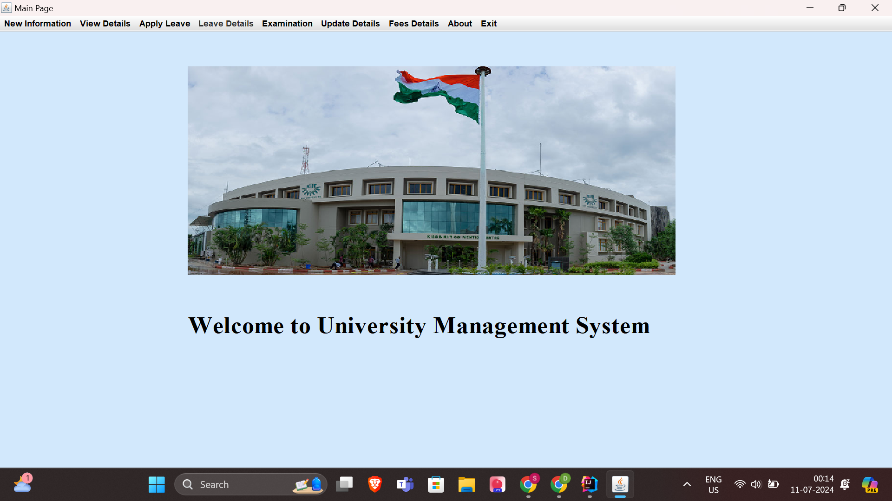
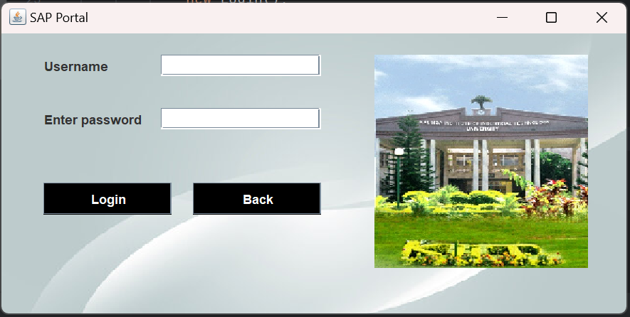

# University Management System

## Overview
The University Management System is a robust platform designed to simplify and enhance the administrative workflow within a university. Developed with Java and MySQL Workbench, this system offers an intuitive interface and optimized performance, making it convenient for university staff to handle various tasks efficiently.

## Features
- *Student and Faculty Management*
  - Add, update, or remove student and faculty information.
  - Access complete profiles of students and faculty members.

- *Leave Management*
  - Manage and process leave requests for both students and faculty.
  - Track leave status and maintain history records.

- *Fee Structure Management*
  - Display fee details for different programs and courses.
  - Modify fee structure as required.

- *User Interface*
  - Built using Java Swing, offering a responsive and easy-to-use interface.

- *Database Management*
  - Powered by MySQL, ensuring reliable and efficient data handling.

## Screenshots

### Home Page

### Login Page

## Usage
  - Log in using the provided admin credentials.
  - Navigate through different sections to manage students, faculty, leave requests, and fee details.

## Feedback
The University Management System has been praised for its user-friendly interface and effective performance, making it a highly valuable tool for university administration.

